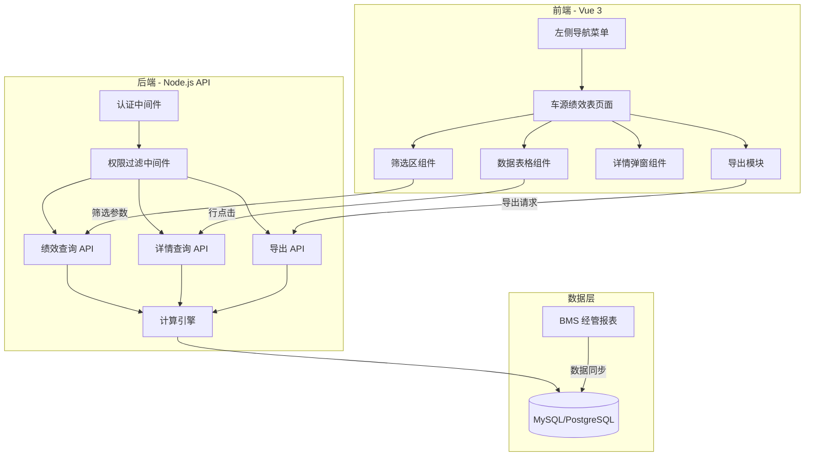
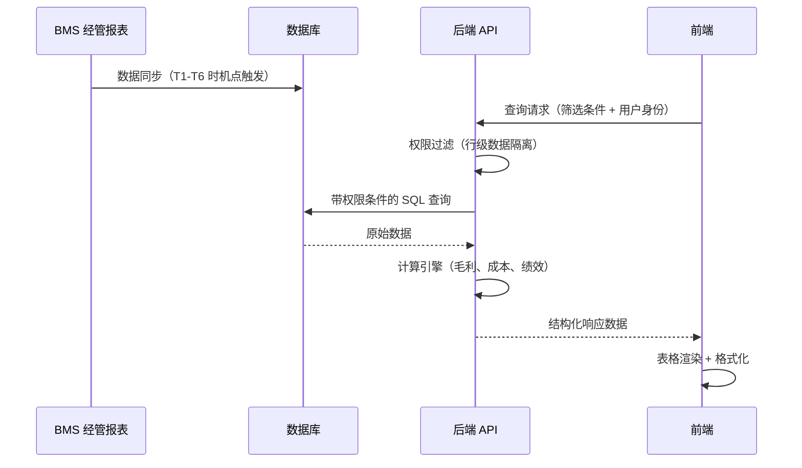

# 技术设计文档：绩效考核报表系统

## 概述

本设计文档描述二手车拍卖平台绩效考核报表系统的技术实现方案。系统以车辆为核心维度，追踪从入库（T1）到售后（T6）的全生命周期数据，自动归集成本、计算毛利与绩效，并提供多角色数据隔离、多维度筛选、详情查看和数据导出功能。

系统从 BMS 经管报表获取上游数据，通过6个时机点（T1-T6）触发成本归集和毛利计算，最终以车源绩效表（约60列）的形式展示给不同角色用户。

### 核心计算公式

- **交易总毛利** = 唯普毛利 + 唯普云毛利 + 汇和毛利 + 机拍毛利（一台车仅归属一方）
- **绩效毛利** = 总交易毛利 - 交付成本 - 检测成本 - 销售成本 - 数据成本 - 政企场地费 - 收购车成本 - 业务合作费
- **总成本** = 提车费 + 检测成本 + 评估费 + 销售成本 + 收购车成本 + 交付成本 + 过户成本 + 垫款利息 + 业务合作服务费 + 其他成本 + 数据成本 + 政企场地费

### 技术选型

由于本项目为全新项目（无已有代码），推荐以下技术栈：

| 层级 | 技术 | 说明 |
|------|------|------|
| 前端框架 | Vue 3 + TypeScript | 组件化开发，适合复杂表格交互 |
| UI 组件库 | Element Plus | 提供表格、筛选器、弹窗等成熟组件 |
| 状态管理 | Pinia | 轻量级状态管理 |
| 后端框架 | Node.js + Express / NestJS | RESTful API 服务 |
| 数据库 | MySQL / PostgreSQL | 关系型数据库，适合结构化报表数据 |
| 导出引擎 | ExcelJS / SheetJS | Excel/CSV 文件生成 |
| 构建工具 | Vite | 快速开发构建 |


## 架构

### 整体架构

系统采用前后端分离的 B/S 架构，前端负责界面展示和交互，后端负责业务逻辑、权限控制和数据计算。



### 数据流



### 时机点数据更新流程


## 组件与接口

### 前端组件结构

```
src/
├── layouts/
│   └── MainLayout.vue              # 主布局（左侧菜单 + 顶部导航 + 内容区）
├── components/
│   ├── sidebar/
│   │   └── SidebarMenu.vue          # 左侧导航菜单（200px 固定宽度）
│   ├── header/
│   │   └── TopNavBar.vue            # 顶部导航栏
│   ├── filter/
│   │   ├── FilterPanel.vue          # 筛选面板容器（支持展开/折叠）
│   │   ├── DateRangeFilter.vue      # 日期范围筛选器（订单清分日/日期/检测过审日期）
│   │   ├── SelectFilter.vue         # 下拉选择筛选器（支持多选、区域联动）
│   │   └── StoreSearchFilter.vue    # 门店搜索联想筛选器（autocomplete）
│   ├── dashboard/
│   │   └── DataDashboard.vue        # 数据看板（6指标：成交车辆/总交易毛利/总绩效毛利/平均单车毛利/售后车辆/售后率）
│   ├── table/
│   │   ├── PerformanceTable.vue     # 车源绩效表主组件（约60列，支持拖拽列序）
│   │   ├── TableSummary.vue         # 数据统计摘要（总成交数、总毛利等）
│   │   └── ColumnConfig.vue         # 列配置管理
│   ├── detail/
│   │   ├── VehicleDetailModal.vue   # 车辆详情弹窗
│   │   ├── BasicInfoSection.vue     # 基础信息区
│   │   ├── FinanceInfoSection.vue   # 财务信息区
│   │   ├── TimelineLog.vue          # 时机点日志（T1-T6）
│   │   └── AfterSaleSection.vue     # 售后信息区
│   └── export/
│       └── ExportButton.vue         # 导出按钮（Excel/CSV）
├── views/
│   ├── HomePage.vue                 # 首页
│   ├── PerformancePage.vue          # 车源绩效表页面
│   ├── AdvancedSearchPage.vue       # 高级搜索页面
│   └── DataExportPage.vue           # 数据导出页面
├── stores/
│   ├── authStore.ts                 # 用户认证与角色状态
│   ├── filterStore.ts              # 筛选条件状态
│   └── performanceStore.ts         # 绩效数据状态
├── services/
│   ├── api.ts                       # API 请求封装
│   ├── performanceService.ts       # 绩效数据服务
│   └── exportService.ts            # 导出服务
├── utils/
│   ├── formatter.ts                 # 金额格式化（千分位、右对齐）
│   ├── permission.ts               # 前端权限工具
│   └── constants.ts                # 常量定义（成本标准、角色枚举等）
└── types/
    ├── vehicle.ts                   # 车辆相关类型定义
    ├── filter.ts                    # 筛选条件类型
    └── permission.ts               # 权限相关类型
```

### 后端 API 接口

#### 1. 绩效数据查询

```
GET /api/v1/performance/vehicles
```

请求参数：

| 参数 | 类型 | 必填 | 说明 |
|------|------|------|------|
| clearingDateStart | string | 否 | 订单清分日起始 |
| clearingDateEnd | string | 否 | 订单清分日结束 |
| dateStart | string | 否 | 日期起始（通用日期筛选） |
| dateEnd | string | 否 | 日期结束 |
| inspectionDateStart | string | 否 | 检测过审日期起始 |
| inspectionDateEnd | string | 否 | 检测过审日期结束 |
| keyword | string | 否 | 车牌/VIN/VID 关键字 |
| contractType | string | 否 | 合同类型（收购/委拍/不限） |
| vehicleStatus | string | 否 | 车辆状态 |
| storeIds | string[] | 否 | 门店 ID 列表 |
| majorRegions | string[] | 否 | 大区域列表 |
| minorRegions | string[] | 否 | 小区域列表 |
| page | number | 否 | 页码，默认 1 |
| pageSize | number | 否 | 每页条数，默认 100 |

响应：

```json
{
  "code": 200,
  "data": {
    "list": [VehiclePerformanceRecord],
    "total": 347,
    "summary": {
      "totalTransactions": 347,
      "totalGrossProfit": 2485000,
      "totalPerformanceProfit": 1885000,
      "avgProfitPerVehicle": 4220,
      "aftersaleCount": 3,
      "aftersaleRate": 0.064
    }
  }
}
```

#### 2. 车辆详情查询

```
GET /api/v1/performance/vehicles/:id/detail
```

响应包含：基础信息、财务信息、成本明细、时机点日志（T1-T6）、售后信息（如有）。

#### 3. 数据导出

```
POST /api/v1/performance/export
```

请求体：与查询接口相同的筛选参数 + `format`（xlsx/csv）。

响应：文件流，Content-Disposition 头包含按命名规则生成的文件名。

#### 4. 筛选选项查询

```
GET /api/v1/performance/filter-options
```

返回当前用户权限范围内可用的门店列表、区域列表、评估师列表等。

#### 5. 区域联动查询

```
GET /api/v1/performance/regions/:majorRegion/sub-regions
```

根据大区域返回对应的小区域列表。


### 后端模块结构

```
server/
├── middleware/
│   ├── auth.ts                      # JWT 认证中间件
│   └── permission.ts               # 行级数据隔离中间件（根据角色注入 WHERE 条件）
├── controllers/
│   ├── performanceController.ts    # 绩效数据查询/导出控制器
│   └── filterController.ts        # 筛选选项控制器
├── services/
│   ├── performanceService.ts       # 绩效业务逻辑
│   ├── calculationEngine.ts        # 计算引擎（毛利、成本、绩效毛利）
│   ├── reversalService.ts          # 售后冲正处理服务
│   └── exportService.ts            # 导出文件生成服务
├── repositories/
│   └── vehicleRepository.ts        # 数据访问层
├── models/
│   └── vehicle.ts                   # 数据模型定义
├── utils/
│   ├── costRules.ts                 # 成本计算规则（T1-T6 各时机点）
│   └── permissionRules.ts          # 权限规则定义（7 个角色）
└── types/
    └── index.ts                     # 类型定义
```

### 权限过滤中间件设计

权限中间件在数据库查询层面实施行级数据隔离，根据用户角色自动注入 WHERE 条件：

| 角色 | SQL 过滤条件 | 筛选器限制 |
|------|-------------|-----------|
| 评估师 | `WHERE evaluator_id = :userId` | 门店、评估师筛选器锁定灰显 |
| 门店总监 | `WHERE store_id = :storeId` | 门店筛选器锁定为本门店 |
| 区域经理 | `WHERE region_id = :regionId` | 区域筛选器锁定为本区域 |
| 汇和财务 | `WHERE store_id IN (:huiheStoreIds)` | 门店限制为12家奥迪门店 |
| 唯普财务 | `WHERE store_id NOT IN (:huiheStoreIds)` | 排除汇和门店 |
| 副部长 | `WHERE department_id = :deptId` | 事业部维度 |
| 绩效管理员 | 无额外条件 | 所有筛选器可用 |

### 操作权限矩阵

| 角色 | 查看 | 导出 | 编辑 | 删除 |
|------|------|------|------|------|
| 评估师 | ✅ | ✅ | ❌ | ❌ |
| 门店总监 | ✅ | ✅ | ❌ | ❌ |
| 区域经理 | ✅ | ✅ | ✅ | ❌ |
| 汇和财务 | ✅ | ✅ | ✅ | ❌ |
| 唯普财务 | ✅ | ✅ | ✅ | ❌ |
| 副部长 | ✅ | ✅ | ✅ | ✅ |
| 绩效管理员 | ✅ | ✅ | ✅ | ✅ |


## 数据模型

### 核心实体关系

```mermaid
erDiagram
    VEHICLE_PERFORMANCE {
        bigint id PK
        varchar license_plate "车牌"
        varchar vin "VIN码"
        varchar vid "VID"
        date confirm_date "确认日期"
        date transaction_date "成交日期"
        varchar contract_type "合同类型: 收购/委拍/不限"
        boolean is_inspected "是否查验"
        varchar vehicle_status "车辆状态"
        boolean is_paid "是否付款"
        varchar aftersale_status "售后状态"
        varchar responsibility_party "责任方"
    }

    VEHICLE_PERFORMANCE ||--|| PRICE_INFO : has
    PRICE_INFO {
        bigint vehicle_id FK
        decimal total_price "总价"
        decimal sale_price "成交价"
        decimal contract_price "合同价"
        decimal auction_price "起拍价"
        decimal comprehensive_service_fee "综合服务费"
    }

    VEHICLE_PERFORMANCE ||--|| PROFIT_INFO : has
    PROFIT_INFO {
        bigint vehicle_id FK
        decimal total_gross_profit "交易总毛利"
        decimal weipu_profit "唯普毛利"
        decimal weipuyun_profit "唯普云毛利"
        decimal huihe_profit "汇和毛利"
        decimal jipai_profit "机拍毛利"
        decimal intermediary_fee "中间商费用"
        decimal share_amount "分成"
        decimal platform_fee "平台使用费"
    }

    VEHICLE_PERFORMANCE ||--|| COST_INFO : has
    COST_INFO {
        bigint vehicle_id FK
        decimal pickup_cost "提车费"
        decimal inspection_cost "检测成本"
        decimal assessment_fee "评估费"
        decimal sales_cost "销售成本"
        decimal purchase_cost "收购车成本"
        decimal onsite_delivery_cost "现场交付成本"
        decimal air_delivery_cost "空中交付成本"
        decimal onsite_transfer_cost "现场过户成本"
        decimal advance_interest "垫款利息"
        decimal business_cooperation_fee "业务合作服务费"
        decimal data_cost "数据成本"
        decimal government_site_fee "政企场地费"
        decimal other_cost "其他成本"
        decimal total_cost "总成本"
        decimal performance_profit "绩效毛利"
        decimal performance_salary "绩效工资（人工核算占位）"
    }

    VEHICLE_PERFORMANCE ||--|| ORG_INFO : belongs_to
    ORG_INFO {
        bigint vehicle_id FK
        varchar store_name "门店名称"
        varchar major_region "大区域"
        varchar minor_region "小区域"
        varchar evaluator "评估师"
        varchar regional_manager "区域经理"
        varchar vice_minister "副部长"
        varchar department "事业部"
        varchar inspector "检测员"
    }

    VEHICLE_PERFORMANCE ||--|| LOGISTICS_INFO : has
    LOGISTICS_INFO {
        bigint vehicle_id FK
        datetime warehouse_time "入库时间"
        varchar warehouse_location "入库地点"
        varchar pickup_person "提车人（提车助手中将车辆送入唯普库的操作人）"
        varchar pickup_type "提车类型: 自提/第三方"
        varchar onsite_delivery_department "现场交付部门"
        varchar air_delivery_department "空中交付部门（服务中心名称/中控）"
        varchar air_delivery_follower "空中交付跟进人（点击资料回收完毕的系统账号操作人）"
        varchar onsite_transfer_department "现场过户部门"
    }

    VEHICLE_PERFORMANCE ||--o{ TRIGGER_LOG : has_many
    TRIGGER_LOG {
        bigint id PK
        bigint vehicle_id FK
        varchar trigger_point "时机编号: T1-T6"
        varchar event_name "事件名称"
        datetime event_time "发生时间"
        varchar location_or_status "地点或状态"
        text cost_or_profit_change "关联成本或毛利变动"
    }

    VEHICLE_PERFORMANCE ||--o{ REVERSAL_RECORD : has_many
    REVERSAL_RECORD {
        bigint id PK
        bigint vehicle_id FK
        datetime reversal_time "冲正时间"
        decimal total_gross_profit_reversal "交易总毛利冲正"
        decimal weipu_profit_reversal "唯普毛利冲正"
        decimal weipuyun_profit_reversal "唯普云毛利冲正"
        decimal huihe_profit_reversal "汇和毛利冲正"
        decimal jipai_profit_reversal "机拍毛利冲正"
        varchar reason "冲正原因"
        boolean is_exempted "是否豁免"
    }

    USER {
        bigint id PK
        varchar username "用户名"
        varchar role "角色"
        bigint store_id FK "所属门店"
        bigint region_id FK "所属区域"
        bigint department_id FK "所属事业部"
    }

    STORE {
        bigint id PK
        varchar name "门店名称"
        varchar major_region "大区域"
        varchar minor_region "小区域"
        boolean is_huihe "是否汇和门店"
    }
```



### 主表设计说明

实际数据库中，为了查询性能，车源绩效数据采用宽表设计（单表约60+列），将价格、毛利、成本、组织等信息平铺在一张主表 `vehicle_performance` 中。上述 ER 图中的拆分仅为逻辑分组说明。

### 关键字段约束

| 字段 | 约束 | 说明 |
|------|------|------|
| vin | UNIQUE | 同一 VIN 码仅计入1次提车费 |
| vehicle_status | ENUM | 已入库/已检测/已清分/已交付/已过户/已售后 |
| contract_type | ENUM | 不限/收购/委拍 |
| is_exempted | BOOLEAN | 豁免标记：非车源部门责任为豁免 |
| performance_profit | DECIMAL(12,2) | 可为负值，负值以红色显示 |
| performance_salary | DECIMAL(12,2) | 人工核算占位字段 |
| government_site_fee | DECIMAL(12,2) | 人工核算字段 |

### 成本计算规则

| 时机 | 成本项 | 金额 | 条件 | 是否沉没成本 |
|------|--------|------|------|-------------|
| T1 入库 | 提车费 | 100元 | 同一VIN仅计1次（含仲裁退车再入库） | ✅ |
| T1 入库 | 提车人/提车类型 | — | 提车人=提车助手操作人；提车类型=自提/第三方 | — |
| T2 检测过审 | 检测成本 | 省内85/省外120 | 同月多次检测分别计费；延期和过审修正不算多次 | ✅ |
| — 数据查询成功 | 数据成本 | 按规则 | 维保/出险/电池等查询成功后触发，不绑定特定时机点 | ✅ |
| T3 成交付款清分后 | 评估费 | 按等级 | 清分后计入 | ✅ |
| T3 成交付款清分后 | 销售成本 | 按车源类型分档 | 清分后计入 | ✅ |
| T3 成交付款清分后 | 收购车成本 | 按车价分档 | 仅收购车 | ✅ |
| T3 成交付款清分后 | 业务合作服务费 | 按集团/门店分档 | 清分后计入，售后不冲正（沉没成本） | ✅ |
| T4 交付型出库 | 现场交付成本 | 150元 | 交付型出库 | ❌ |
| T5 过户资料回收 | 现场过户成本 | 350元 | 过户费≠0 | ❌ |
| T5 过户资料回收 | 空中交付成本 | 50元 | 资料回收前车辆不在唯普库 | ❌ |
| T5 过户资料回收 | 空中交付跟进人 | — | 点击资料回收完毕的系统账号操作人姓名 | — |

### 售后冲正规则

- **可冲回项**：交易总毛利、唯普毛利、唯普云毛利、汇和毛利、机拍毛利
- **沉没成本（不冲回）**：检测成本、评估费、销售成本、收购车成本、提车费、垫款利息、现场交付成本、空中交付成本、现场过户成本、业务合作服务费、数据成本
- **豁免判断**：责任方为非车源部门（检测责任、服务中心责任等）→ 豁免，冲正金额不纳入绩效扣减
- **非豁免**：责任方为车源部门（车源生态事业部）→ 冲正后绩效毛利全额纳入评估师考核

### 费用项变更规则

- 费用项金额会发生调整，调整后，**调整前已生成的费用项成本不变**
- 例：原检测成本75元，后改成85元，已生成的75元不变，仅新生成的按85元计算
- 当前出险成本标准：**26元/次**（原28元）


## 正确性属性

*属性（Property）是指在系统所有合法执行路径中都应成立的特征或行为——本质上是对系统应做什么的形式化陈述。属性是人类可读规格说明与机器可验证正确性保证之间的桥梁。*

### Property 1: 交易总毛利等于四方毛利之和且仅归属一方

*For any* 车辆记录，交易总毛利应等于唯普毛利 + 唯普云毛利 + 汇和毛利 + 机拍毛利，且四项中最多只有一项为非零值（一台车仅归属一方）。

**Validates: Requirements 1.1**

### Property 2: 零售衍生收益计算

*For any* 存在零售衍生单的车辆，零售衍生收益应等于成交价 - 合同价。

**Validates: Requirements 1.3**

### Property 3: 提车费幂等性（VIN 唯一）

*For any* VIN 码，无论该车辆入库多少次（包括仲裁退车再入库），提车费始终为100元，不会重复计入。

**Validates: Requirements 2.1**

### Property 4: 时机点成本自动归集

*For any* 车辆，在各时机点触发时，系统应按以下规则计入成本：T2检测过审时计入检测成本（省内85/省外120）；T3成交时计入评估费和销售成本（按车源类型分档），收购车另计入收购车成本（按车价分档）；T4交付型出库时计入现场交付成本150元；T5过户资料回收时，若过户费≠0则计入现场过户成本350元，若车辆不在唯普库则计入空中交付成本50元。

**Validates: Requirements 2.2, 2.5, 2.6, 2.7, 2.8**

### Property 5: 总成本公式一致性

*For any* 车辆记录，总成本应等于提车费 + 检测成本 + 评估费 + 销售成本 + 收购车成本 + 交付成本 + 过户成本 + 垫款利息 + 业务合作服务费 + 其他成本 + 数据成本 + 政企场地费。

**Validates: Requirements 2.9**

### Property 6: 绩效毛利公式一致性

*For any* 车辆记录，绩效毛利应等于总交易毛利 - 交付成本（提车费 + 现场交付成本/空中交付成本 + 现场过户成本）- 检测成本 - 销售成本 - 数据成本 - 政企场地费 - 收购车成本 - 业务合作费。

**Validates: Requirements 3.1**

### Property 7: 售后冲正生成与绩效重算

*For any* 售后执行完成（T6）的车辆，系统应自动生成冲正行（包含交易总毛利、唯普毛利、唯普云毛利、汇和毛利、机拍毛利的冲正金额），且冲正后绩效毛利应被重新计算。

**Validates: Requirements 4.1, 4.2**

### Property 8: 豁免与非豁免判定

*For any* 发生售后的车辆，若责任方为非车源部门则标记为豁免（冲正金额不纳入绩效扣减），若责任方为车源部门则标记为非豁免（冲正后绩效毛利全额纳入考核）。

**Validates: Requirements 4.3, 4.4**

### Property 9: 沉没成本不可冲回

*For any* 发生售后冲正的车辆，以下成本项在冲正前后应保持不变：检测成本、评估费、销售成本、收购车成本、提车费、垫款利息、现场交付成本、空中交付成本、现场过户成本、业务合作服务费、数据成本。

**Validates: Requirements 4.5**

### Property 10: 时机点日志完整性

*For any* 车辆在某个时机点（T1-T6）发生事件时，系统应生成一条包含时机编号、事件名称、发生时间、地点或状态、关联成本或毛利变动的日志记录。

**Validates: Requirements 5.1, 5.2, 5.3, 5.4, 5.5, 5.6**

### Property 11: 时机点日志时间排序

*For any* 车辆的时机点日志列表，日志应按发生时间升序排列。

**Validates: Requirements 5.7**

### Property 12: 统计摘要与数据一致性

*For any* 查询结果集，统计摘要中的总成交数应等于结果集记录数，总交易毛利应等于所有记录交易总毛利之和，总绩效毛利应等于所有记录绩效毛利之和，平均单车毛利应等于总绩效毛利/总成交数，售后车辆数应等于售后状态记录数，售后率应等于售后车辆数/总成交数。

**Validates: Requirements 6.3**

### Property 13: 金额格式化

*For any* 数值型金额，格式化函数应输出包含千分位分隔符的字符串；若值为负数，输出应包含负号且对应的 CSS 类为红色。

**Validates: Requirements 3.2, 6.6**

### Property 14: 区域联动筛选

*For any* 大区域选择值，小区域下拉列表中的所有选项应仅属于该大区域。

**Validates: Requirements 8.2**

### Property 15: 门店模糊匹配

*For any* 门店名称关键字输入，自动联想建议列表中的每个门店名称应包含该关键字。

**Validates: Requirements 8.3**

### Property 16: 筛选条件交集查询

*For any* 筛选条件组合，查询结果中的每条记录应同时满足所有已设置的筛选条件。

**Validates: Requirements 8.4**

### Property 17: 导出文件内容完整性

*For any* 导出操作，生成的文件应包含需求规定的所有列（序号、车牌、VIN码、VID、确认日期、成交日期等30列），且数据行数应与当前筛选结果一致。

**Validates: Requirements 9.1, 9.2**

### Property 18: 导出文件命名规则

*For any* 导出操作，生成的文件名应匹配格式：`报表名_日期范围_导出时间_用户名.{xlsx|csv}`。

**Validates: Requirements 9.3**

### Property 19: 角色数据隔离

*For any* 用户角色和查询请求（包括导出），返回的所有记录应满足该角色的数据范围约束：评估师仅看自己名下车辆、门店总监仅看本门店、区域经理仅看本区域、汇和财务仅看汇和门店、唯普财务仅看非汇和门店、绩效管理员可看全部。

**Validates: Requirements 9.4, 10.1, 10.2, 10.3, 10.4, 10.5, 10.6**

### Property 20: 操作权限控制

*For any* 用户角色和操作请求，评估师和门店总监的编辑和删除操作应被拒绝，区域经理和财务角色的删除操作应被拒绝，仅副部长和绩效管理员可执行删除操作。

**Validates: Requirements 10.8**

### Property 21: 售后车辆详情展示售后区域

*For any* 存在售后记录的车辆，详情弹窗应包含售后信息区域（售后原因、责任方、额外损失、冲正行详情）。

**Validates: Requirements 7.4**


## 错误处理

### 前端错误处理

| 场景 | 处理方式 |
|------|---------|
| API 请求超时 | 显示"请求超时，请稍后重试"提示，提供重试按钮 |
| 网络断开 | 显示离线提示，自动检测网络恢复后重新加载 |
| 筛选结果为空 | 显示"暂无符合条件的数据"提示信息（需求 8.7） |
| 导出文件过大 | 显示进度条，支持后台导出 + 下载通知 |
| 权限不足 | 操作按钮灰显不可点击，点击时提示"您没有该操作权限" |
| 表格数据加载失败 | 显示错误提示，保留筛选条件，提供重新加载按钮 |
| 详情弹窗加载失败 | 弹窗内显示错误信息，提供关闭和重试按钮 |

### 后端错误处理

| 场景 | HTTP 状态码 | 处理方式 |
|------|------------|---------|
| 未认证 | 401 | 返回认证失败，前端跳转登录页 |
| 权限不足 | 403 | 返回权限不足错误，记录审计日志 |
| 参数校验失败 | 400 | 返回具体的参数错误信息 |
| 数据不存在 | 404 | 返回资源不存在 |
| 计算引擎异常 | 500 | 记录错误日志，返回"数据计算异常，请联系管理员" |
| 导出生成失败 | 500 | 记录错误日志，返回导出失败提示 |
| 数据库查询超时 | 504 | 返回查询超时，建议缩小筛选范围 |

### 数据一致性保护

- 成本计算和毛利计算使用数据库事务，确保原子性
- 冲正行生成与绩效毛利重算在同一事务中完成
- 提车费的 VIN 唯一性通过数据库唯一约束 + 应用层幂等检查双重保障
- 导出操作使用快照隔离级别，确保导出数据的一致性

## 测试策略

### 双重测试方法

本系统采用单元测试 + 属性测试的双重测试策略：

- **单元测试**：验证具体示例、边界情况和错误条件
- **属性测试**：验证跨所有输入的通用属性

两者互补，共同提供全面的测试覆盖。

### 属性测试配置

- **测试库**：fast-check（TypeScript 属性测试库）
- **每个属性测试最少运行 100 次迭代**
- **每个属性测试必须引用设计文档中的属性编号**
- **标签格式**：`Feature: performance-appraisal, Property {number}: {property_text}`
- **每个正确性属性由一个属性测试实现**

### 单元测试范围

单元测试聚焦于以下方面，避免编写过多单元测试（属性测试已覆盖大量输入）：

| 测试类别 | 测试内容 | 示例 |
|---------|---------|------|
| 具体示例 | 需求文档中的案例数据验证 | 粤B55555 案例的完整生命周期计算 |
| 边界情况 | 同月多次检测计费（需求 2.3） | 同一车辆1月检测3次，检测成本 = 3 × 85 |
| 边界情况 | 当月检测次月成交不重复计费（需求 2.4） | 1月检测、2月成交，检测成本仅计1次 |
| 边界情况 | 筛选结果为空（需求 8.7） | 返回空列表 + 提示信息 |
| 错误条件 | 未认证用户访问 API | 返回 401 |
| 错误条件 | 评估师尝试删除操作 | 返回 403 |
| 集成测试 | 筛选条件重置后默认值 | 日期默认为本周 |
| UI 示例 | 已交付状态绿色标签 | CSS class = status-excellent |
| UI 示例 | 已售后状态红色标签 | CSS class = status-poor |
| UI 示例 | 响应式断点布局 | 1200px → 4列，1024px → 3列，768px → 2列，<768px → 1列 |

### 属性测试范围

每个正确性属性对应一个属性测试：

| 属性编号 | 测试描述 | 生成器 |
|---------|---------|--------|
| Property 1 | 交易总毛利 = 四方毛利之和，且仅一方非零 | 随机车辆记录（随机归属方 + 随机毛利值） |
| Property 2 | 零售衍生收益 = 成交价 - 合同价 | 随机成交价和合同价 |
| Property 3 | 提车费幂等性 | 随机 VIN + 随机入库次数 |
| Property 4 | 时机点成本归集 | 随机车辆 + 随机时机点组合 |
| Property 5 | 总成本 = 各成本项之和 | 随机成本项值 |
| Property 6 | 绩效毛利公式 | 随机毛利和成本值 |
| Property 7 | 售后冲正生成与重算 | 随机售后车辆 |
| Property 8 | 豁免/非豁免判定 | 随机责任方 |
| Property 9 | 沉没成本不变 | 随机车辆 + 冲正操作 |
| Property 10 | 时机点日志完整性 | 随机时机点事件 |
| Property 11 | 日志时间排序 | 随机时间戳列表 |
| Property 12 | 统计摘要一致性 | 随机查询结果集 |
| Property 13 | 金额格式化 | 随机数值（含正数、负数、零） |
| Property 14 | 区域联动 | 随机大区域 + 小区域映射 |
| Property 15 | 门店模糊匹配 | 随机关键字 + 门店列表 |
| Property 16 | 筛选交集查询 | 随机筛选条件组合 + 随机数据集 |
| Property 17 | 导出内容完整性 | 随机筛选结果 |
| Property 18 | 导出文件命名 | 随机报表名、日期、用户名 |
| Property 19 | 角色数据隔离 | 随机角色 + 随机数据集 |
| Property 20 | 操作权限控制 | 随机角色 + 随机操作类型 |
| Property 21 | 售后详情展示 | 随机车辆（有/无售后记录） |

